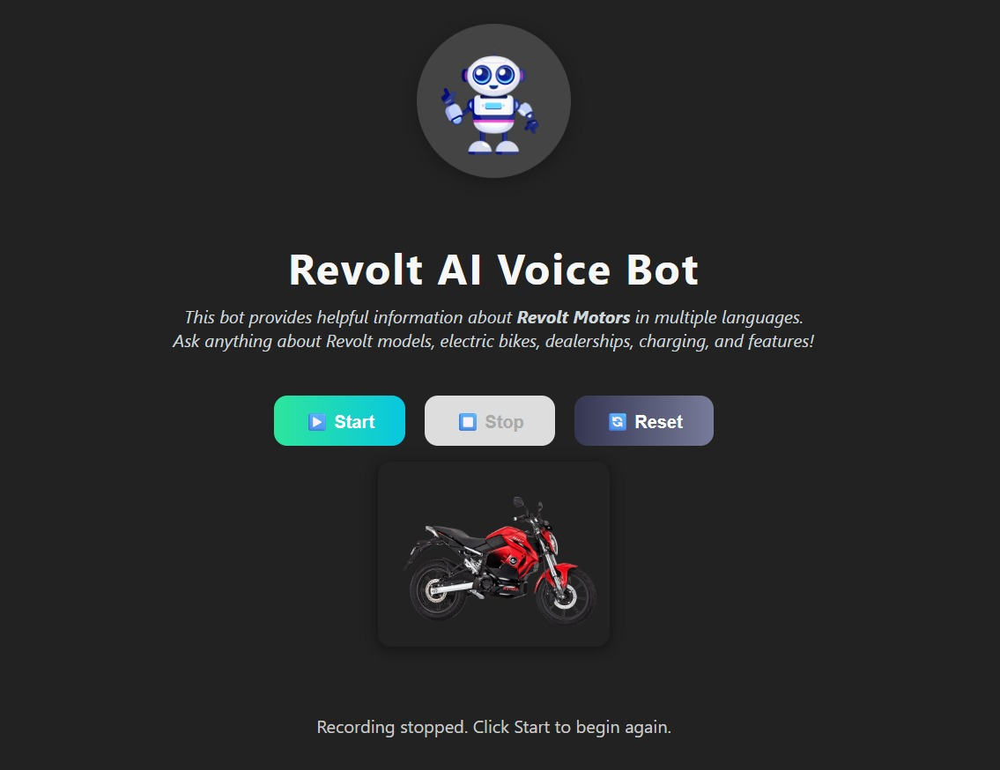

<h1 align="center">Revolt Motors AI Voice Assistant</h1>

<p align="center">
  
</p>


A **real-time conversational voice interface** using the **Google Gemini Live API**, specifically designed for **Revolt Motors** – India's leading electric motorcycle company.  
This application replicates the functionality of the Revolt Motors chatbot with **advanced voice interaction capabilities**, **interruption support**, and **low-latency responses**.

---

## 🚀 Features

### Core Functionality
- **Real-time Voice Interaction**: Natural conversation with AI assistant "Rev"  
- **Interruption Support**: Interrupt the AI while it's speaking for dynamic conversations  
- **Low Latency**: Optimized for 1–2 second response times  
- **Push-to-Talk**: Space bar functionality for easy voice control  
- **Multi-language Support**: Handles conversations in various languages  

### Technical Features
- **Server-to-Server Architecture**: Robust WebSocket implementation  
- **Google Gemini Live API Integration**: Powered by the latest AI models  
- **Real-time Audio Processing**: 16kHz PCM audio streaming  
- **Cross-platform Compatibility**: Works on desktop and mobile browsers  
- **Theme Support**: Dark and light mode toggle  
- **Responsive Design**: Mobile-first approach with clean UI  

### Revolt Motors Specific
- **Product Information**: Details about RV400, RV1+, and other models  
- **Pricing & Availability**: Current pricing and dealership information  
- **Technical Specifications**: Battery, range, charging details  
- **Booking Support**: Test ride and purchase assistance  
- **After-sales Support**: Service and maintenance queries  

---

## 🏗️ Project Structure


```
revolt-motors-voice-chat/
├── server.js                 # Main server file with Gemini Live API integration
├── package.json             # Dependencies and scripts
├── .env                     # Environment variables (create this)
├── .env.example             # Environment template
├── .gitignore              # Git ignore rules
├── README.md               # This comprehensive guide
└── public/                 # Frontend assets
    ├── index.html          # Main HTML file with clean UI
    ├── styles.css          # Complete styling with theme support
    └── app.js              # Frontend JavaScript with WebRTC integration
```


---

## 📋 Prerequisites

### Required Software
- Node.js (v16 or higher) – [Download](https://nodejs.org/)  
- npm (comes with Node.js)  
- Modern web browser with microphone support (Chrome, Firefox, Safari, Edge)  

### Required API Access
- Google AI Studio API Key – [Get it here](https://aistudio.google.com)  
- Microphone permissions in your browser  

---

## 🛠️ Installation & Setup

### 1. Clone the Project
```bash
git clone <repository-url>
cd revolt-motors-voice-chat

```
### 2. Backend Setup

```bash
Navigate to backend directory
cd backend

Install dependencies
npm install


# Set up environment variables
Create or edit .env file with your Gemini API key
echo "GEMINI_API_KEY=your_gemini_api_key_here" > .env
```

**Important**: Replace `your_gemini_api_key_here` with your actual Google Gemini API key.

### 3. Frontend Setup

```bash
# Navigate to frontend directory (from project root)
cd ../frontend

# Install dependencies
npm install
```

## 🚀 Running the Application

### 1. Start the Backend Server

```bash
# Start the Backend Server
cd backend
npm start
```

Backend listens on `http://localhost:3001` (or configured port)

### 2. Start the Frontend Application

```bash
# In a new terminal window/tab:
cd frontend
npm start
```

The React application will start on `http://localhost:3000` and automatically open in your browser.

## 🔧 Configuration

### Environment Variables

- Create `.env` in backend directory with:
```env
GEMINI_API_KEY=your_actual_gemini_api_key_here
```

### API Key 

1. Visit [Google AI Studio](https://makersuite.google.com/app/apikey)  
2. Create new key  
3. Copy and paste into `.env`

## 🎯 Usage

1. Open `http://localhost:3000`  
2. Click **Start** (microphone icon) to begin speaking  
3. Ask Revolt Motors-related questions:  
   - "What are the features of the RV400?"  
   - "How much does the RV1 cost?"  
   - "Where's the nearest dealership?"  
   - "How do I book a test ride?"  
4. Use **Stop** to end recording  
5. Use **Reset** to clear conversation and start fresh  

## 🔍 Troubleshooting

### Common Issues

1. **Backend Not Connecting**  
   - Verify backend is running on port 3001  
   - Confirm `.env` file exists with valid API key

2. **No Microphone or Audio**  
   - Check browser microphone permissions  
   - Confirm microphone functionality with other apps

3. **API Key Issues**
   - Validate Gemini API key and quota  
   - Review backend logs for API errors

### Adjusting Ports

If you encounter port conflicts:

- Backend defaults to port 3001  
- Frontend runs on port 3000  
- Modify `.env` or configuration files if needed to avoid conflicts 

## 📚 Dependencies

### Backend Dependencies
- `express` – Node web framework  
- `ws` – WebSocket implementation  
- `@google/genai` – Google Gemini AI SDK  
- `cors` – Cross-origin resource sharing  
- `dotenv` – Environment variable loader  

### Frontend Dependencies
- `react` – UI library  
- `react-dom` – React rendering engine  
- `react-scripts` – Create React App tooling  

## 🤝 Contributing

1. Fork the repository  
2. Create a feature branch  
3. Commit your changes with clear messages  
4. Test your changes thoroughly  
5. Submit a pull request for review  


## 🆘 Support

If you need help:

1. Check the Troubleshooting section  
2. Review browser console and server logs  
3. Ensure dependencies are installed correctly  
4. Verify your API key is valid and active  

---

**Note**: This AI assistant is specialized for Revolt Motors products and information. It gracefully handles unrelated queries by guiding users back to relevant topics.

---

## 📝 Assignment & Credits

**Created by:** Pawan Pandey  
**Context:** This project was developed as part of the **RattanIndia – Technical Assessment** for the role of **Software Engineer**.

**Assignment Details (from HR):**
- **Objective:** Develop a real-time, conversational voice interface using the **Gemini Live API**, replicating the functionality of the existing **Revolt Motors** chatbot.
- **Assessment Link:** *RattanIndia – Technical Assessment* (as provided by HR)

> Thank you for shortlisting me for the next stage. This repository contains the implementation aligned with the stated objective, including real-time voice interaction, interruption support, and low-latency streaming over WebSockets.


